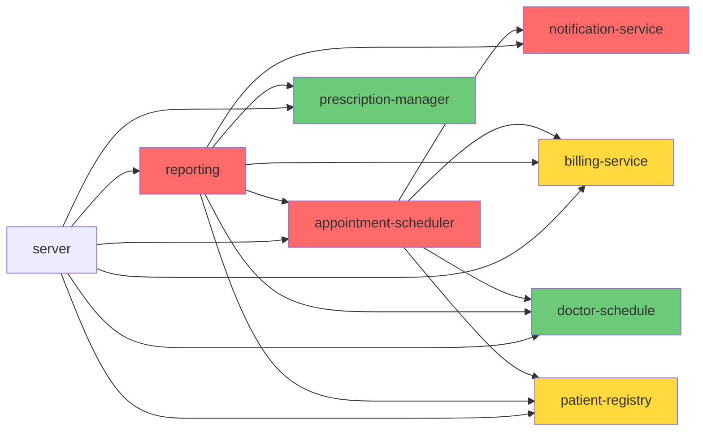

# Demo 4: Migration Planning — Coupling Analysis & Migration Order

## Scenario

ClinicFlow's modules are tangled — `reporting.ts` imports from every other module, `appointment-scheduler.ts` directly calls billing and notifications. The team wants to move toward a **modular architecture**. But where do you start?

## Approach: Analyze Coupling, Plan Migration Order

We'll generate micro-tools that map the dependency structure and recommend a migration order.

## Pre-requisite

Same as Demo 3 — git history must be generated.

## Steps

### Step 1: Generate the Coupling Analyzer

```
Create a script that analyzes the import dependencies between all
TypeScript source files. For each module, calculate afferent coupling
(how many modules depend on it), efferent coupling (how many modules
it depends on), and instability (Ce / (Ca + Ce)). Output a table and
a Mermaid dependency diagram. Save it as scripts/analyze-coupling.js
```

Run it and discuss:
- **`reporting.ts`** depends on everything but nothing depends on it — pure consumer, instability near 1.0
- **`doctor-schedule.ts`** and **`prescription-manager.ts`** have low instability — stable foundations
- **`appointment-scheduler.ts`** is the most tangled — high both incoming and outgoing
- Where is the Mermaid diagram most tangled?

### Step 2: Generate the Migration Planner

```
Create a script that recommends a phased migration plan for
modularizing this codebase. Combine the coupling analysis with
the hotspot data from our other analysis scripts. Group modules
into phases: quick wins first (stable, low coupling), then
high-value targets, then the tangled core last.
Save it as scripts/plan-migration.js
```

Run it and discuss the phased plan:

**Expected phases:**
- **Phase 1 — Quick Wins:** `doctor-schedule.ts`, `prescription-manager.ts` — already well-structured, low coupling, extract as independent modules
- **Phase 2 — High-Value Targets:** `patient-registry.ts`, `billing-service.ts` — moderate coupling, need API boundaries and missing tests
- **Phase 3 — Core Untangling:** `notification-service.ts` (use Sprout Class, see Demo 2), `appointment-scheduler.ts` (characterize + refactor, see Demo 1), `reporting.ts` (simplifies naturally as other modules get clean APIs)

### Step 3: Discuss

Key questions:
- Does the phased plan make sense? Would you change the ordering?
- Why start from the edges and work inward?
- How does `reporting.ts` naturally improve when other modules get clean APIs?
- Notice how this plan connects back to Demos 1 and 2 — the migration plan tells you *which approach* to use for each module

### Step 4: Execute a Quick Win (Optional)

If time allows, pick the first recommended step:

```
Extract doctor-schedule.ts into a fully independent module with
a clean public API. Make sure nothing breaks.
```

## Expected Coupling Diagram (Mermaid)



## Key Takeaway

> Coupling analysis reveals the true structure of your system. Migration should start from the edges (stable, decoupled modules) and work inward toward the tangled core. AI generates the analysis tools; the developer makes the strategic decisions about migration order and timing.
