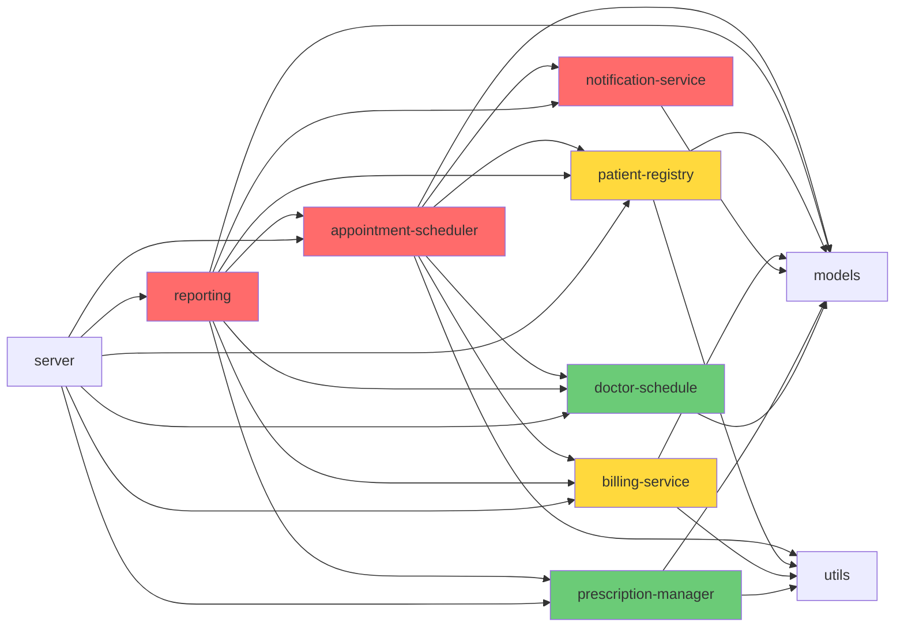

# Demo 4: Migration Planning — Coupling Analysis & Migration Order

## Scenario

ClinicFlow's modules are tangled — `reporting.ts` imports from every other module, `appointment-scheduler.ts` directly calls billing and notifications. The team wants to move toward a **modular architecture**. But where do you start?

## Approach: Analyze Coupling, Plan Migration Order

We'll generate micro-tools that:
1. Map the actual dependency structure of the codebase
2. Calculate coupling metrics for each module
3. Recommend a migration order based on data

## Steps

### Step 1: Generate the Coupling Analyzer

```
Create scripts/analyze-coupling.js — a Node.js script that:

1. Scans all .ts files in src/ for import statements
2. Builds a dependency graph (which module imports which)
3. For each module, calculates:
   - Afferent coupling (Ca): how many modules depend on THIS module (incoming)
   - Efferent coupling (Ce): how many modules THIS module depends on (outgoing)
   - Instability: Ce / (Ca + Ce) — 0 = maximally stable, 1 = maximally unstable
4. Outputs a coupling matrix:

   Module                    Ca  Ce  Instability  Risk
   ──────────────────────────────────────────────────────
   appointment-scheduler.ts   2   4    0.67        HIGH
   reporting.ts               0   6    1.00        HIGH
   notification-service.ts    1   2    0.67        HIGH
   billing-service.ts         2   1    0.33        MED
   patient-registry.ts        3   1    0.25        MED
   doctor-schedule.ts         2   0    0.00        LOW
   prescription-manager.ts    1   0    0.00        LOW

5. Outputs a Mermaid dependency diagram:

   graph LR
     appointment-scheduler --> doctor-schedule
     appointment-scheduler --> patient-registry
     appointment-scheduler --> billing-service
     appointment-scheduler --> notification-service
     ...

The script should work by running: node scripts/analyze-coupling.js
```

### Step 2: Run and Discuss

Run the coupling analyzer and discuss:
- **`reporting.ts`** has instability 1.0 — it depends on everything but nothing depends on it. It's pure consumer.
- **`doctor-schedule.ts`** and **`prescription-manager.ts`** have instability 0.0 — they're stable foundations with no outgoing dependencies.
- **`appointment-scheduler.ts`** is the most coupled module — it imports from 4 other modules AND 2 modules depend on it.
- Where is the Mermaid diagram most tangled?

### Step 3: Generate the Migration Planner

```
Create scripts/plan-migration.js — a Node.js script that:

1. Reads coupling data (from analyze-coupling.js logic)
2. Optionally reads hotspot data (from demo-3 tools if available)
3. Recommends a phased migration plan:

   Phase 1 — Quick Wins (stable, low coupling):
   Modules with low instability and low coupling are safe to
   extract/modularize first. They have clean boundaries.

   Phase 2 — High-Value Targets (moderate coupling, high change):
   Modules that change frequently and have moderate coupling.
   Modularizing these has the highest ROI.

   Phase 3 — Core Untangling (high coupling, high risk):
   The most tangled modules. Require careful extraction with
   characterization tests first.

4. Outputs:

   === MIGRATION PLAN ===

   Phase 1: Quick Wins
   ├── doctor-schedule.ts (Ca=2, Ce=0, Instability=0.00)
   │   → Already well-structured. Add interface, extract as independent module.
   └── prescription-manager.ts (Ca=1, Ce=0, Instability=0.00)
       → Clean module. Add interface, extract as independent module.

   Phase 2: High-Value Targets
   ├── patient-registry.ts (Ca=3, Ce=1, Instability=0.25)
   │   → Moderate coupling. Define clear API boundary, add missing tests.
   └── billing-service.ts (Ca=2, Ce=1, Instability=0.33)
       → Extract rates/rules to config. Define invoice service interface.

   Phase 3: Core Untangling
   ├── notification-service.ts (Ca=1, Ce=2, Instability=0.67)
   │   → High bug ratio. Use Sprout Class for new features, gradually replace.
   ├── appointment-scheduler.ts (Ca=2, Ce=4, Instability=0.67)
   │   → God module. Characterize → refactor → extract. See Demo 1.
   └── reporting.ts (Ca=0, Ce=6, Instability=1.00)
       → Pure consumer. Last to migrate — will simplify as other modules get APIs.

The script should work by running: node scripts/plan-migration.js
```

### Step 4: Run and Discuss

Run the migration planner and discuss:
- Does the phased plan make sense?
- Why start with the edges (stable, decoupled modules) and work inward?
- How does `reporting.ts` naturally improve when other modules get clean APIs?
- What's the relationship between this migration plan and demos 1-2?

### Step 5: Execute a Quick Win (Optional)

Pick the first recommended migration step and execute it live:

```
Extract doctor-schedule.ts into an independent module by:
1. Defining a DoctorScheduleService interface
2. Ensuring all consumers import through the interface
3. Adding any missing tests
4. Documenting the module's public API
```

## Expected Coupling Diagram (Mermaid)



## Expected Results

Two working scripts:
- `scripts/analyze-coupling.js` — Dependency graph + coupling metrics + Mermaid diagram
- `scripts/plan-migration.js` — Phased migration plan with rationale

## Key Takeaway

> Coupling analysis reveals the true structure of your system. Migration should start from the edges (stable, decoupled modules) and work inward toward the tangled core. AI generates the analysis tools; the developer makes the strategic decisions about migration order and timing.
